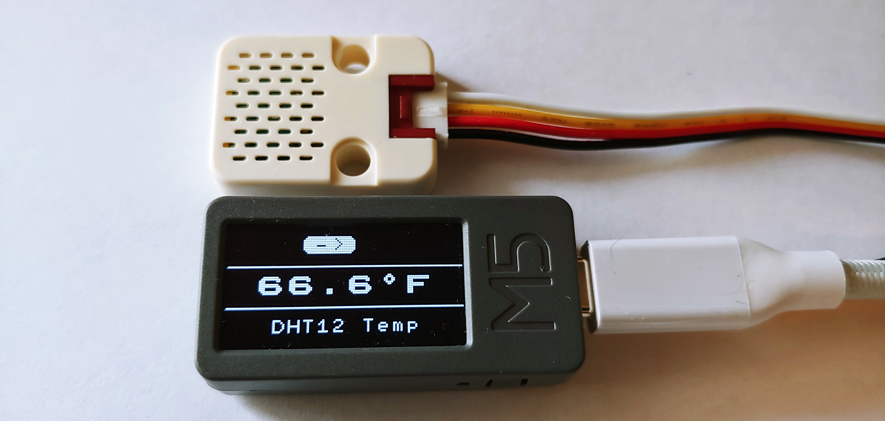
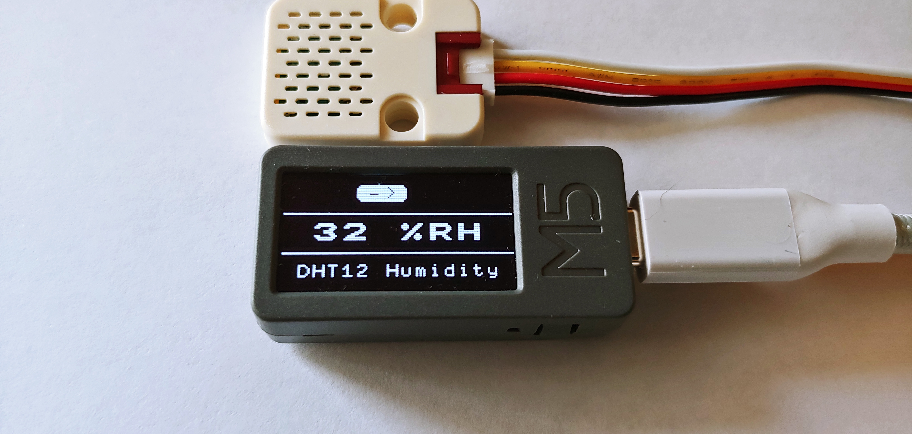
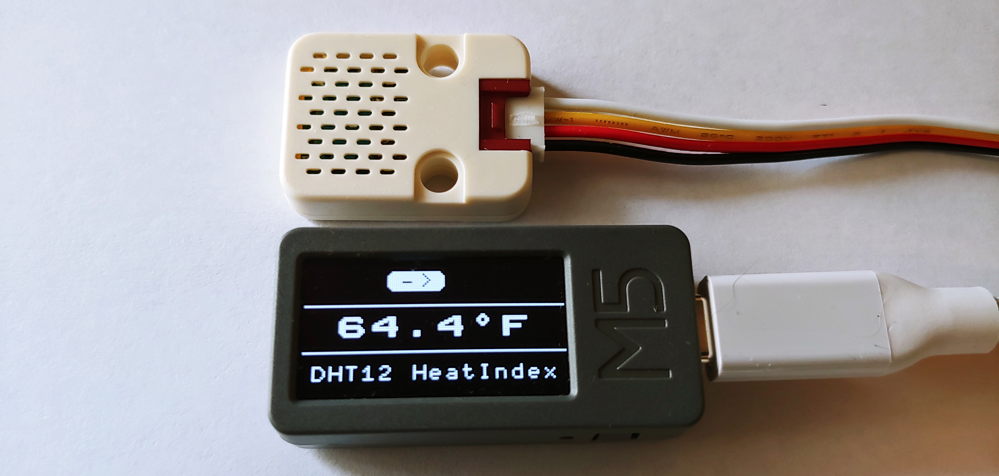
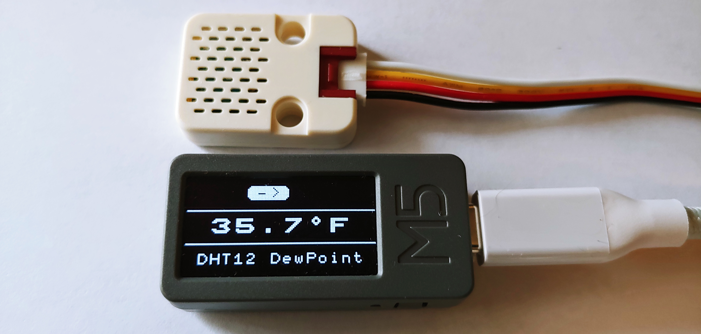

# M5StickMonoEnvirSensor
M5Stick with monochrome display, using Smooth C++ library and LittlevGL Graphics library that displays different views of Environment data fro the DHT12 sensor.

## Overview
This application shows how to use the Smooth C++ library and the LittlevGL Graphichs library
to display DHT12 values in four different views.  The app has two tasks running besides the main Application Task.
The details about the application memory usage, bin file size and versions of software used on this project are
listed at the top of the App.cpp file.

## Views
The following views are dsiplayed by this application.
- Temperature View - display temperature in degrees fahrenheit
- Humidity View - display the humidity
- Heat Index View - display the calculated heat index from temperature and humidity
- Dew Point View - display the calculated dew point from temperature and humidity

## A view
A view consists of a title pane, a content pane and a menu pane.  The title pane is at the bottom of the screen
and the title changes depending upon which view is selected.  The content pane varies depending upon the view 
selected and is positioned in the middle of the screen.  And lastly the menu pane is at the top of the screen
where the 1 hardware button on the M5StickMono is located (on the side).  The menu shows a button with
an arrow which is used to inform user to "Go to Next View".  The app uses LittlevGL input device driver to debounce the buttons.
The LittlevGL input device driver creates an on-clicked event when the hw button is pressed and the released.
It also shows the gui button pressed or released when the hardware button is pressed or released.

## Tasks
The app has 2 additional tasks running besides the Application Task. 
- PollSensorTask - A task that periodically collects temperature and humidity from the DHT12.
- LvglTask - A tasks that runs LittlevGL.  All files in gui folder are running under this task.

## Pictures of the various views
The Temperature View

The Humidity View

The Heat Index View

The Dew Point View

# Versions
### v1.0 : 
- initial release
### v2.0 : 
- update to lvgl v7.11.0 commit ec9de51 - March 16, 2021
- update to Smooth master commit 5578b8b - April 15, 2021 
- update to esp-idf v4.3-beta3 commit e9cf9e2 - April 14, 2021